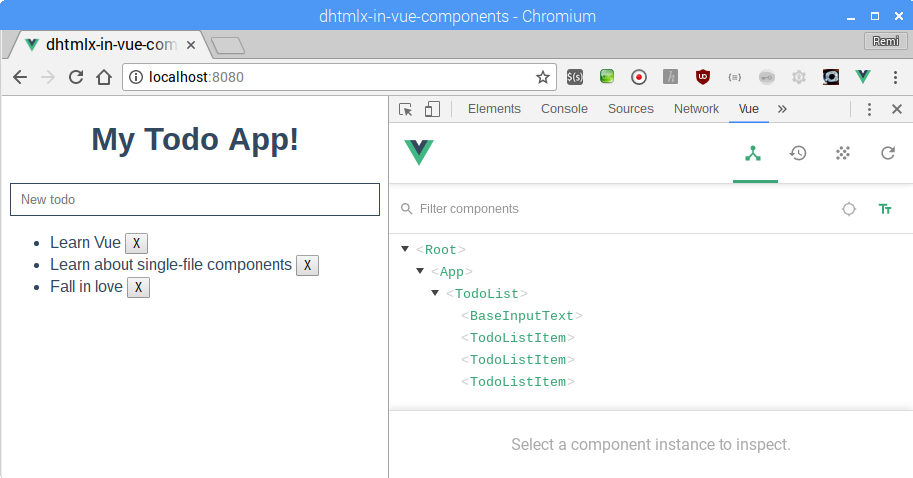

# vue-cli

This project was cloned from [https://codesandbox.io/s/3y8nwrlr66](https://codesandbox.io/s/3y8nwrlr66) and is a simple Todo App build in Vue:

# Installation

- `git clone https://github.com/rkristelijn/vue-cli.git`
- `cd vue-cli`
- `npm i`
- `npm run serve`

# Result



```bash
 DONE  Compiled successfully in 2382ms                                                                                10:51:12

 
  App running at:
  - Local:   http://localhost:8080/ 
  - Network: http://10.0.2.15:8080/

  Note that the development build is not optimized.
  To create a production build, run npm run build.
```
